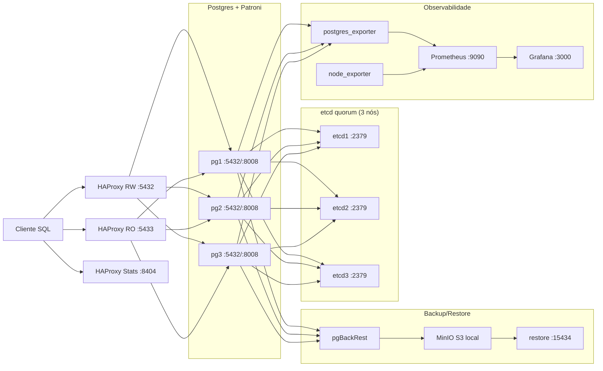

# Arquitetura do postgres-ha-chaos-lab

## Objetivo
Ambiente 100% local (Linux Ubuntu 24.04+ nativo ou WSL2 + Docker Compose) para demonstrar HA/DR/Chaos em Postgres com evidência prática.

## Topologia visual (Mermaid)

## Componentes
- `pg1`, `pg2`, `pg3`: Postgres 17 com Patroni.
- `etcd1..3`: DCS do Patroni para eleição e lock de líder.
- `haproxy`: endpoint único RW (`15432`) e RO (`15433`) via checks REST do Patroni.
- `minio`: S3 local para repositório pgBackRest.
- `pgbackrest`: backup/WAL archive e PITR.
- `prometheus` + `grafana`: métricas, regras e dashboards.
- `toxiproxy` + perfil `pumba` + isolamento seletivo via `iptables` nos nós PG: simulação de falhas de rede e caos controlado.

## Fluxo de escrita
1. Cliente escreve em `localhost:15432`.
2. HAProxy envia apenas para nó que responde `200` em `/primary`.
3. Patroni mantém lock no etcd para evitar dual-primary.
4. Em falha do primário, a escrita só volta após eleição e commit bem-sucedido via RW.

## Fluxo de leitura
1. Cliente lê de `localhost:15433`.
2. HAProxy envia apenas para nós que respondem `200` em `/replica?lag=...`.
3. Réplicas fora do limite de lag saem do balanceamento.

## Evidências
Todos os cenários escrevem artefatos em `artifacts/<RUN_ID>/`.
`make verify` consolida em `SUMMARY.md` + `.zip`.
